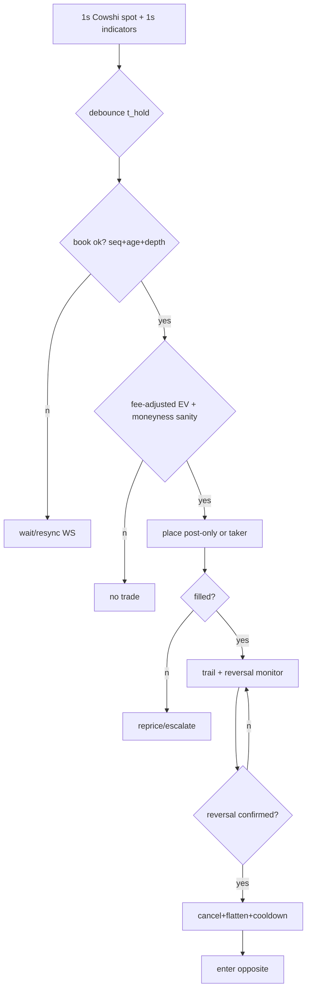
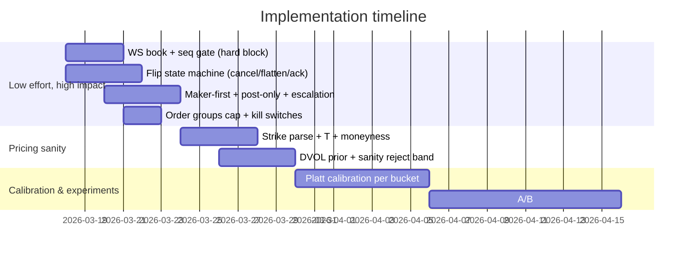

# Short‑Dated Binary Execution and Reliable Reversal Flips for BTC Bias Engine

## Executive summary

Your edge at 1s cadence is not “predict BTC” but “trade *probability repricing speed* under cost + book constraints.” For short‑dated Kalshi/Polymarket contracts, fees peak near 50¢ and rounding matters, so mid‑probability momentum entries are often fee‑negative unless the move is large and fast. citeturn0search0turn3search16turn0search3turn0search7  
The two biggest operational drivers of “buys early but fails to flip” are: (a) stale market state (REST book age, seq gaps), and (b) no explicit flip state machine (cancel/flatten/enter opposite with ack-based synchronization). Kalshi WS orderbook snapshot+delta is the correct substrate for 1s flip logic, while order groups cap burst risk. citeturn0search2turn0search17turn0search1  
Prioritize low-effort changes: WS-first book freshness gate; maker-first/post-only routing; explicit reversal-confirmed flip workflow; fee-adjusted EV thresholds tied to price/spread/depth; then add moneyness+time-to-expiry + a DVOL volatility prior and post-hoc probability calibration (Platt→isotonic). citeturn0search0turn1search0turn1search2  

## Literature and platform mechanics

Binary contracts are traded via a limit order book; you pay bid/ask friction and platform fees, so microstructure/urgency dominate at sub‑minute horizons. Polymarket’s CLOB and order lifecycle explicitly define post‑only behavior (reject if order would cross), and “heartbeat” is required for unattended automation safety. citeturn3search1turn3search8turn3search2  
Kalshi’s fee schedule is explicitly parabolic in price \(P(1-P)\) (taker coefficient 0.07; maker 0.0175 in its published schedule), and fees are rounded, so your EV gate must scale with price bucket and must treat near‑50¢ as “most expensive to be wrong.” citeturn0search0turn3search3turn0search4turn0search5  
For maker-first routing, limit-order-book market-making models formalize why quoting inside the spread trades off fill probability vs adverse selection and inventory/time risk; you can use those insights to tune your maker→taker escalation. citeturn2search0turn2search17  
Intraday BTC predictability is regime-dependent: evidence supports intraday momentum tied to high volume/volatility sessions, but also shows momentum and reversal patterns that change with jumps/liquidity—this supports debounce + “reversal confirm” rather than single-tick flips. citeturn1search3turn1search19  
For moneyness/volatility anchoring, options-implied state prices (risk-neutral density) are classically inferred from option prices; DVOL is a practical implied-vol proxy for crypto. Use as a sanity prior, not an oracle. citeturn1search1turn1search0turn1search20  

## Signal-to-execution mapping for 1s indicators

### Convert 1s indicators into tradable “impulse → continuation → exhaustion” events

Unspecified thresholds are set to safe defaults; tune using your new decomposition logs.

**Inputs (1s loop):**
- Cowshi BTC spot: returns and acceleration (Δ1s, Δ3s, Δ10s; and second derivative).
- Contract book (WS): best bid/ask equivalent, depth@top, microprice proxy (bid/ask weighted), and `book_age_ms`.

**Debounce (reduce false triggers):**
- Require indicator alignment for `t_hold = 2–5s` (default 3s).  
- Require spot move magnitude `|Δ10s| ≥ ε` (default ε = 0.05–0.10% spot), or “impulse score” above percentile threshold (e.g., 95th of last hour). The regime-dependence evidence supports this gating. citeturn1search3turn1search19  

**Staleness rules (no stale-book trading):**
- If WS sequence gap (missing deltas) → force re-snapshot + pause trading until fresh. citeturn0search2turn0search6  
- Gate on `book_age_ms ≤ A` where default `A=250ms` (HFT) and `A=500ms` (main engine). If you’re still on REST, set `A≈poll_interval/2` and accept that flip performance will be limited.

**Fee-adjusted EV gate (price-aware):**
- Estimate taker fee burden grows with \(P(1-P)\); require *incremental* edge to exceed fee+spread. citeturn0search0turn3search16turn0search7  
- Default EV gate (cents):
  - `edge_req = spread_cents + fee_est(P) + slippage_buffer`
  - slippage_buffer defaults: 1–2¢ if book_age_ms < 250ms else “NO TRADE”
- Impose a hard “no-trade midband” unless urgency is high: default do not open new positions if entry price in [48,52] cents unless the signal is “strong reversal” (see below). Rationale: fees peak near 50¢ and your historical data already shows a collapse above 50¢; the platform mechanics make this expected. citeturn0search0turn0search4turn3search16  

### Flip logic: reliable opposite-side entry on confirmed reversals

Define a **flip** as a deterministic state transition, not “place opposite order while something else is live.”

**Reversal confirmation (default):**
- Opposite-direction indicator alignment holds for `t_flip_hold = 1–3s` (default 2s).
- Spot confirms: `Δ3s` sign matches reversal and exceeds `ε_flip` (default 0.03–0.07%).
- Contract lag signal: contract microprice ROC lags spot ROC (your thesis “contract spike lags BTC”). Implement as:
  - `lag = ROC_spot_3s − k*ROC_contract_3s` where `k` is fit from data (default 1.0), and require `lag > lag_min`.  
This is an empirical hypothesis; you must validate by correlating lag with forward contract repricing under fresh-book conditions. citeturn1search3turn1search19  

**Flip workflow (ack-synchronized):**
1. Cancel resting orders (entry/TP) and wait for order update ack (Kalshi `user_orders` WS; Polymarket heartbeat/order lifecycle). citeturn0search14turn3search2turn3search8  
2. Flatten (reduce_only or equivalent) before opening opposite direction. Kalshi create-order models include `reduce_only`; use it to ensure “flip” doesn’t unintentionally add risk. citeturn0search5turn0search1  
3. Enforce a micro cooldown `t_cd=500ms–2s` unless “strong reversal” (defined below).  
4. Enter opposite side using execution selection (maker-first vs taker) driven by urgency and book quality.

## Execution algorithms, trailing exits, and order groups

### Execution options comparison

| Mode | Latency | Fill probability | Fee impact | Adverse selection risk | Use when |
|---|---:|---:|---:|---:|---|
| Post-only inside-spread (maker-first) | low–med | med | best | higher if signal decays | early impulse, stable book |
| Maker→taker escalation (timer) | med | high | med | med | most 1s signals |
| Immediate taker (cross) | lowest | highest | worst near 50¢ | lowest time risk | strong reversal, near expiry |

Mechanics: post-only exists on Polymarket and is explicitly “reject if crosses.” Kalshi supports `post_only` in its order model/API. citeturn3search8turn0search5turn0search1  

### Maker-first quoting and adaptive limit placement

**Default maker-first entry:**
- If spread ≥ 2¢: place at `bid+1` (post-only).  
- If spread = 1¢: you cannot “improve” → use either (a) join bid (post-only) if non-urgent, or (b) cross if urgent.

**Escalation timer (default 1.0–2.5s):**
- If not filled and signal still valid: reprice one tick toward execution (or cross) based on updated EV gate.

### Trailing take-profit directly on upward movement

Implement trailing on **contract price high-water**, but adapt trail distance to **contract velocity** (ROC). This matches your observation that contract repricing can lag BTC and then “run” during the window.

Pseudocode (engine-agnostic):

```python
# called every tick (<=1s); requires fresh book
if position.open:
    p = contract_mid_or_last_fillable()
    v = roc(p, 3s)  # contract velocity
    position.peak = max(position.peak, p)

    # dynamic trail: tighter when velocity is high
    trail = base_trail + k / max(v_abs, v_floor)
    stop = position.peak - trail

    if p <= stop:
        exit_marketable_limit()
```

Defaults (unspecified): `base_trail=3¢`, `k=0.5¢·s`, `v_floor` prevents divide-by-zero. Tune by maximizing `realized_entry_net_edge` conditional on volatility regime.

### Immediate flip vs hedge, and order group safety

For true “flip,” avoid holding both sides unless you are intentionally hedging inventory; with short-dated binaries, simultaneous YES and NO positions can be a cost sink (fees + spread twice). Use “flatten then enter,” synchronized on order updates. citeturn0search5turn0search14  
Use **order groups** as a hard operational fail-safe: set a contracts cap over 15 seconds; when hit, orders in the group are canceled and no new ones placed until reset. This prevents runaway flip storms during whipsaw. citeturn0search17turn0search10  

Mermaid signal/exec diagram:



## Calibration, moneyness, and volatility anchoring

### Probability calibration

Your system already logs predicted probabilities and Brier/log-loss; the next step is to **map score→probability** per regime/session bucket using post-hoc calibration. Empirical work shows many classifiers are poorly calibrated and compares Platt scaling vs isotonic regression; isotonic can overfit with small samples. citeturn1search2  
Defaults (unspecified):
- Use Platt scaling until you have ~500+ settled samples per bucket; then trial isotonic with cross-validation.

### Options-implied prior and moneyness/time-to-expiry

Add strike parsing and compute:
- moneyness \(m = (S-K)/K\)
- time-to-expiry \(T\) (years)
- volatility prior \(\sigma\) from DVOL (annualized), scaled by \(\sqrt{T}\) (rough but useful) citeturn1search0turn1search20  

Compute a sanity probability bound (rough digital-call proxy). The theoretical link between options and state-contingent probabilities is well established; use it only to stop “82% on a 7¢ contract” type mistakes. citeturn1search1  

## Experiments, metrics, and operational risks

### Instrumentation and success criteria

Minimum per-trade decomposition columns (you are close): `predicted_prob`, `entry_price`, `fee_estimate`, `maker_taker`, `spread`, `depth_top`, `book_age_ms`, `moneyness`, `T`, `realized_entry_net_edge`, plus Brier/log-loss. Fee rounding and Kalshi’s fixed-point migration mean you must normalize dollars/fixed-point reliably in the feed and logs. citeturn4search2turn4search6turn0search0  

Primary success metrics:
- Calibration: rolling Brier/log-loss, compared to base-rate baseline. citeturn1search2  
- Economics: fee-adjusted net edge at entry; realized_entry_net_edge at exit; maker vs taker cohort delta. citeturn0search0turn2search2  
- Flip quality: (a) flip latency (time from reversal confirm to opposite fill), (b) flip slippage, (c) whipsaw rate.

Statistical power (defaults, unspecified):
- For A/B on flip success rate with a 5–10pp expected lift, plan ~500–1,000 flips per arm. For per-trade P&L shifts, you’ll often need thousands of trades because variance is high; prioritize “mechanism metrics” (fill probability vs book_age_ms) that converge faster.

### Operational and legal/settlement differences

WS reliability: implement seq integrity; on gap → resubscribe and block trading until snapshot re-established. Kalshi’s orderbook channel is snapshot+delta by design; build a “staleness circuit breaker.” citeturn0search2turn0search6  
Polymarket automation must respect heartbeats or orders cancel automatically; integrate this into your ops watchdog. citeturn3search2  
Contract equivalence risk: Kalshi contracts have exchange rulebook + contract specifications; Polymarket resolution relies on UMA Optimistic Oracle dispute mechanics. Do not treat “same question” as identical without an equivalence layer. citeturn4search0turn4search1turn4search13  

Mermaid timeline (low-effort first):



